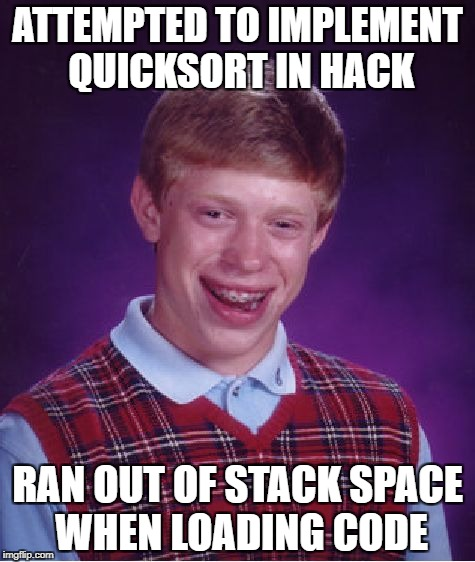

# Project 4: Machine Language

Every hardware platform is designed to execute commands in a certain machine
language, expressed using agreed-upon binary codes. Writing programs directly in
binary code is possible, yet unnecessary. Instead, we can write such programs
using a low-level symbolic language called assembly, and have them translated
into binary code by a program called the Assembler.

In this project you will write some low-level assembly programs, and will be
forever thankful for high-level languages like Java and Python. In the process
of working on this project, you will become familiar with the assembly process
(translating from symbolic language to machine-language) and you will appreciate
visually how native binary code executes on the target hardware platform. These
lessons will be learned in the context of writing and testing a few low-level
programs.

## Objective

Implement all assembly programs described in this project.

## Resources

- Unit 4 of the lectures and book
- The CPUEmulator

## Contract

Write and test the programs described in this folder.
When executed on the supplied CPUEmulator, your programs should generate the
results mandated by the requirements given in each .asm file.

## What To Submit

- You should submit a zip file with the following files:
  mult/Mult.asm, fill/Fill.asm, swap/Swap.asm, note each is placed in a
  directory. Additionally, your submission should include an AUTHORS file
  that is located at the root directory (not in any directory).
- The AUTHORS file must contain the following:
  - In the first line: login(s) of the author(s), separated by commas and
    nothing else! If you work alone, do not include a comma.
    Logins should be identical to the names of your home folders and are
    case-sensitive.
  - Name(s), email(s) and ID(s) of the project's author(s).
  - Any remarks you have about your submission.

## Proposed Working Method

We recommend starting with mult/Mult.asm, then proceeding to fill/Fill.asm,
and finishing with swap/Swap.asm. For each, follow these steps:

- Start by loading and editing the supplied skeletal .asm file.
- Use your favorite text editor to write your code.
- Use the supplied CPUEmulator to load, and then execute, the .asm file.
  This can be done either interactively, or using the supplied .tst script.
- If there are any errors, go to step 1.

## Tips

### Debugging

The Hack language is case-sensitive. A common error occurs when one writes, say,
"@foo" and "@Foo" in different parts of one's program, thinking that both labels
are treated as the same symbol. In fact, the assembler treats them as two
different symbols. This bug is difficult to detect, so be aware of it!

### CPUEmulator

The supplied CPU Emulator includes a ROM (also called Instruction Memory)
representation, into which the binary code is loaded, and a RAM representation,
which holds data.

For ease of use, the emulator enables the user to view the loaded ROM-resident
code in either binary mode, or in symbolic / assembly mode. In fact, the
CPUEmulator even allows loading symbolic code written in assembly directly into
the ROM, in which case the emulator translates the loaded code into binary code
on the fly.

### (Optional) Challenges

Assembly programming can be highly rewarding, allowing direct and complete
control of the underlying machine. Many applications that require high
performance, such as video games and operating systems, rely on assembly
for performance-critical code.

Still, writing even simple programs in assembly can be quite difficulty. For
example, try implementing a simple sorting algorithm such as insertion-sort.
If you're brave -- it can be implemented using less than 50 ASM lines!

An even harder task is to implement assembly programs in hardware. For example,
can Mult.asm be implemented in hardware? This is actually not that complicated!
If you're interested, this can be done using ShiftLeft chips (a lot of them!).

## License

This file is part of nand2tetris, as taught in The Hebrew University, and
was written by Aviv Yaish. It is an extension to the specifications given
[here](https://www.nand2tetris.org) (Shimon Schocken and Noam Nisan, 2017),
as allowed by the Creative Common Attribution-NonCommercial-ShareAlike 3.0
Unported [License](https://creativecommons.org/licenses/by-nc-sa/3.0/).
