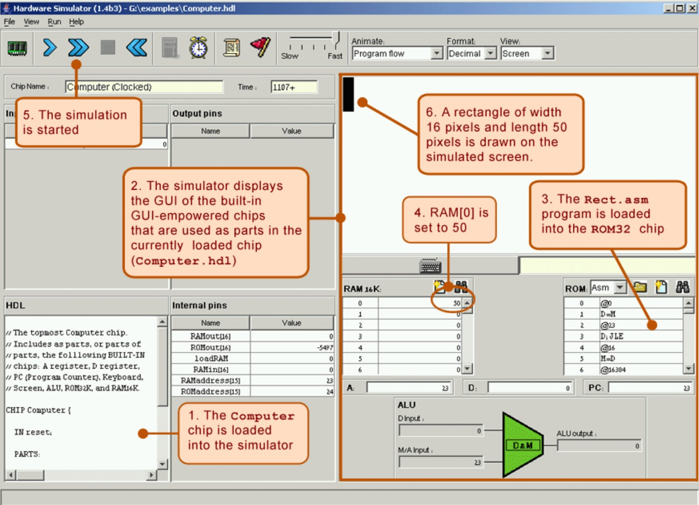

# Project 5: Computer Architecture

In previous projects we've built the computer's basic processing and storage
devices (ALU and RAM, respectively). In this project we will put everything
together, yielding the complete Hack Hardware Platform. The result will be a
general-purpose computer that can run programs written in the Hack machine
language.

## Objective

Complete the construction of the Hack CPU and the Hack hardware platform,
leading up to the top-most Computer chip.

## Resources

- Projects 1, 2, 3
- Unit 5 of the lectures and book
- The Hardware Simulator

## Contract

You should implement each gate using the Hardware Description Language (HDL).

For each gate, your implementation should exactly match the logic given in
the gate's .hdl file.

## What To Submit

- You should submit a zip file with the following files:
  AUTHORS, Computer.hdl, Memory.hdl, CPU.hdl, ExtendAlu.hdl, CpuMul.hdl.
- You can create & use new chips, but should include them in the submission.
- Include other files required by your project, if there are any.
- The submission should not contain any folder.
- The AUTHORS file must contain the following:
  - In the first line: login(s) of the author(s), separated by commas and
    nothing else! If you work alone, do not include a comma.
    Logins should be identical to the names of your home folders and are
    case-sensitive.
  - Name(s), email(s) and ID(s) of the project's author(s).
  - Any remarks you have about your submission.

## Proposed Working Method

We recommend building the chips in the following order:
Memory, CPU, ExtendAlu, CpuMul, Computer

### Memory

This chip includes three chip-parts: RAM16K, Screen, and Keyboard.
The Screen and the Keyboard are available as built-in chips, and thus there is
no need to implement them. Although the RAM16K chip was built in Project 3, we
recommend using its built-in version, as it provides a debugging-friendly GUI.

### CPU

This chip can be constructed according to the proposed CPU implementation given
in Figure 5.9 of Chapter 5, using the ALU and register chips built in Projects
2 and 3, respectively.

Note that the CPU relies on the Aregister and Dregister chips, which you haven't
built in previous projects. There is no need to implement them yourselves, you
can use the built-in versions.
The built-in versions of these two chips have exactly the same interface and
functionality as those of the Register chip specified in Chapter 3; however,
they feature GUI side-effects that come handy for testing purposes.

In principle, your CPU implementation may include internal chips of your own
specification, i.e. chips not mentioned in Figure 5.9 of Chapter 5. However,
this is not recommended, and will most likely yield a less efficient CPU
design. If you choose to create new chips not mentioned in the book, be sure to
document and unit-test them carefully before you plug them into the
architecture.

You should test your chip using the supplied CPU.tst and CPU.cmp files.
We provide alternative tests which are less thorough but do not require using
the built-in DRegister) in CPU-external.tst and CPU-external.cmp.

### ExtendAlu and CpuMul

These chips are almost identical to the "regular" ALU and CPU, but also support
left and right shifts. You can (and are recommended) to off-load most of the
logic to the "regular" chips where possible.

### Computer

Note: it's important to unit-test the CPU and Memory chips before proceeding to
build the overall Computer chip.
After you've finished the CPU and Memory chips, the top-most Computer chip can
be constructed according to the proposed implementation shown in Figure 5.10 of
Chapter 5.
As before, we haven't built the ROM32K chip (which is used for our Computer's
instruction memory) in previous projects. There is no need to build this chip
yourselves - you can use the built-in ROM32K chip.

You can test the Computer chip by running some Hack programs on it.
A natural way to test the Computer chip is to have it execute some sample
programs written in the Hack machine language. In order to perform such a test,
one can write a test script that:

- Loads the Computer.hdl chip description into the supplied Hardware Simulator
- Loads a machine-level program from an external .hack file into the ROM
  chip-part of the loaded Computer.hdl chip
- Runs the clock enough cycles to execute the loaded instructions

Before testing your Computer chip on any one of the supplied programs, read the
relevant .tst file and be sure to understand the instructions given to the
simulator. The guide given in appendix 3 of the book ("Test Scripting
Language") may be a useful reference here.
We supply all the files necessary to run three such tests, as follows:

- Add.hack: adds up the two constants 2 and 3 and writes the result in RAM[0].
  This test can be run using the ComputerAdd.tst and ComputerAdd.cmp files.
  An alternative test (less thorough but only requires usage of the built-in
  RAM16K) is given in ComputerAdd-external.tst and ComputerAdd-external.cmp. 
- Max.hack: computes the maximum of RAM[0] and RAM[1] and writes the result in
  RAM[2]. As before, it can be run using the ComputerMax files, and we provide
  an alternative test (less thorough but only requires usage of the built-in
  RAM16K) in the ComputerMax-external files.
- Rect.hack: draws a rectangle of width 16 pixels and length RAM[0] at the top
  left of the screen. As before, it can be run using the ComputerRect files,
  and we provide an alternative test (but does not require usage of any
  built-in chips) in the ComputerRect-external files.

### Input Validity

Our Computer is complex and supports all kinds of "advanced" functionality.
Here are some input validity assumptions which can help:

- Writing into Memory addresses 24576 and after is undefined, there is no need
  to deal with it.
- Reading from 24576 is allowed, and reading from any larger address is not and
  again is undefined.
- Assigning the A register values between 24577-32767 is allowed and valid, so
  you can assume that the Memory chip is not accessed when these values are
  assigned.

## Correctness, Efficiency, and Code-reuse

Please refer to the notes of project 1 regarding grading metrics.

## Tips

### Tools

All the chips mentioned in this project, including the topmost Computer chip,
can be implemented and tested using the supplied hardware simulator. Here is a
screen shot of testing the Rect.hack program on a Computer chip implementation:

The Rect program illustrated above draws a rectangle of width 16 pixels and
length RAM[0] at the top-left of the screen. Now here is an interesting
observation: normally, when you run a program on some computer and you don't
get the desired result, you conclude that the program is buggy.
In our case though, the supplied Rect program is bug-free. Thus, if running
this program yields unexpected results, it means that the computer platform on
which it runs (Computer.hdl and/or some of its lower-level chip parts) is
buggy. If that is the case, you have to debug your chips.

### The Complete Hack Chip-set

The following list provides the API for all chips we built so-far, including
those from the current project.

- Add16(a=,b=,out=). Adds up two 16-bit two's complement values.
- ALU(x=,y=,zx=,nx=,zy=,ny=,f=,no=,out=,zr=,ng=). Hack ALU.
- And(a=,b=,out=). And gate.
- And16(a=,b=,out=). 16-bit And.
- ARegister(in=,load=,out=). Address register (built-in).
- Bit(in=,load=,out=). 1-bit register.
- CPU(inM=,instruction=,reset=,outM=,writeM=,addressM=,pc=). Hack CPU.
- CpuMul(inM=,instruction=,reset=,outM=,writeM=,addressM=,pc=). Extended CPU.
- DFF(in=,out=). Data flip-flop gate (built-in).
- DMux(in=,sel=,a=,b=). Channels the input to one out of two outputs.
- DMux4Way(in=,sel=,a=,b=,c=,d=). Channels the input to one out of four outputs.
- DMux8Way(in=,sel=,a=,b=,c=,d=,e=,f=,g=,h=). A DMux with eight outputs.
- DRegister(in=,load=,out=). Data register (built-in).
- ExtendAlu(x=,y=,instruction=,out=,zr=,ng=). Extended ALU.
- HalfAdder(a=,b=,sum=, carry=). Adds up 2 bits.
- FullAdder(a=,b=,c=,sum=,carry=). Adds up 3 bits.
- Inc16(in=,out=). Sets out to in + 1.
- Keyboard(out=). Keyboard memory map (built-in).
- Memory(in=,load=,address=,out=). Data memory of the Hack platform (RAM).
- Mux(a=,b=,sel=,out=). Selects between two inputs.
- Mux16(a=,b=,sel=,out=). Selects between two 16-bit inputs.
- Mux4Way16(a=,b=,c=,d=,sel=,out=). Selects between four 16-bit inputs.
- Mux8Way16(a=,b=,c=,d=,e=,f=,g=,h=,sel=,out=). A Mux with 8 inputs.
- Nand(a=,b=,out=). Nand gate (built-in).
- Not16(in=,out=). 16-bit Not.
- Not(in=,out=). Not gate.
- Or(a=,b=,out=). Or gate.
- Or8Way(in=,out=). 8-way Or.
- Or16(a=,b=,out=). 16-bit Or.
- PC(in=,load=,inc=,reset=,out=). Program Counter.
- RAM8(in=,load=,address=,out=). 8-word RAM.
- RAM64(in=,load=,address=,out=). 64-word RAM.
- RAM512(in=,load=,address=,out=). 512-word RAM.
- RAM4K(in=,load=,address=,out=). 4K RAM.
- RAM16K(in=,load=,address=,out=). 16K RAM.
- Register(in=,load=,out=). 16-bit register.
- ROM32K(address=,out=). Instruction memory of the Hack platform (built-in).
- Screen(in=,load=,address=,out=). Screen memory map (built-in).
- ShiftLeft(in=,out=). Shift the input one bit to the left.
- ShiftRight(in=,out=). Shift the input one bit to the right.
- Xor(a=,b=,out=). Xor gate.

We went through quite a lot, huh? Great job!

### (Optional) Challenge

Note that the CPU supports more commands than shown in the table given to you.
For example, the CPU can perform a Nand16 operation between the outputs of the
Dregister and the Aregister.
This means that our assembly language is less expressive than our CPU!
Can you think of other operations that the CPU can perform that are not exposed
by our assembly language?

## License

This file is part of nand2tetris, as taught in The Hebrew University, and
was written by Aviv Yaish. It is an extension to the specifications given
[here](https://www.nand2tetris.org) (Shimon Schocken and Noam Nisan, 2017),
as allowed by the Creative Common Attribution-NonCommercial-ShareAlike 3.0
Unported [License](https://creativecommons.org/licenses/by-nc-sa/3.0/).
