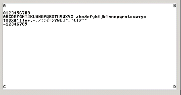
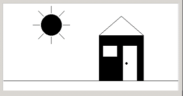
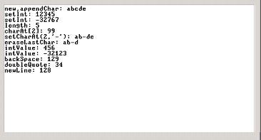

partner1_username, partner2_username

# Project 12: The Operating System

## Submitter details

- Partner1FirstName Partner1LastName, ID 011111111, partner1_email@mail.huji.ac.il
- Partner2FirstName Partner2LastName, ID 022222222, partner2_email@mail.huji.ac.il

## Submitted Files

- README.md: This file.
- Array.jack:
- Keyboard.jack:
- Math.jack:
- Memory.jack:
- Output.jack:
- Screen.jack:
- String.jack:
- Sys.jack:

## Remarks

- In any case where the expected behavior is unclear, you should match the
  built-in OS.
- Your submission should compile successfully on the built in JackCompiler and
  run successfully on the built in VMEmulator.
- You should submit a zip file with the following files:
  README.md, Array.jack, Keyboard.jack, Math.jack, Memory.jack, Output.jack,
  Screen.jack, String.jack, Sys.jack.
- Include other files required by your project, if there are any.
- The submission should not contain any folder.
- The README.md file must contain the following:
  - In the first line: login(s) of the author(s), separated by commas and
    nothing else! If you work alone, do not include a comma.
    Logins should be identical to the names of your home folders and are
    case-sensitive.
  - Name(s), email(s) and ID(s) of the project's author(s).
  - Any remarks you have about your submission.

## Overview

The OS is implemented as a collection of 8 Jack classes.
Each class can be implemented and unit-tested in isolation, and in any desired
order. We recommend proceeding like so:

1. Array,
2. Sys,
3. String,
4. Keyboard,
5. Output,
6. Math (start with easy functions like abs, min, max, and then progress to
multiply, sqrt and finally divide),
7. Memory (start with easy functions like init, peek, poke and then alloc and
dealloc),
8. Screen (start with easy functions like init, clearScreen, setColor,
drawPixel, drawRectangle, and then progress to drawCircle, drawLine)

## How to Work on Each Class

To develop, compile, and test each OSClass.jack class in isolation, follow this
procedure:

1. Put the OSClass.jack that you are developing in the same directory that
   includes the supplied test program designed to test it;
2. Compile the directory using the supplied Jack compiler.
   This will result in compiling your OSClass.jack as well as the supplied test
   class files. In the process, a new OSClass.vm file will be created;
3. Load the directory into the supplied VM Emulator;
4. Execute the code and check if the OS services are working properly,
   according to the guidelines given below.

Recall that the supplied VM Emulator features a built-in implementation of the
entire Jack OS. With that in mind, the rationale of the above procedure is as
follows. Normally, when the supplied VM Emulator encounters a call to an OS
function, it handles the call by invoking a built-in implementation of that
function. However, if the compiled directory contains a .vm file that includes
a VM implementation of the function, this  implementation will be executed,
short-cutting the built-in implementation. This practice follows the reverse
engineering spirit of GNU Unix and Linux: it allows you to build and test
different OS modules in isolation, as if all the other OS modules are
implemented properly and operating side-by-side with the currently-developed
module. That's important, since the OS class that you are presently developing
may well include calls to the services of other OS classes.

## OS Classes and Test Programs

There are eight OS classes: Memory, Array, Math, String, Screen, Keyboard and
Sys. For each OS class Xxx we supply a skeletal Xxx.jack class file with all
the required subroutine signatures, corresponding test class named Main.jack,
and related test scripts.

Only Memory, Array and Math have tests with test scripts (.tst files). The
remaining test programs include no test scripts, and should be compiled and
executed on the supplied VM Emulator, and then their outputs should be compared
to the pictures supplied in each test directory.








## Corner cases

Anything not mentioned here or within the .jack template files supplied to you
should be implemented to match the built-in OS, so if you're wondering how to
support various input/output characters or anything else, you should write a
short .jack file that tests this and run it using the built-in OS.

## Writing Jack Code

- Write / edit your Jack class files using a standard text editor. We recommend
  using [VSCode](https://code.visualstudio.com/) together with the recommended
  nand2tetris syntax highlighting
  [plugin](https://marketplace.visualstudio.com/items?itemName=loyio.Nand2Tetris-vscode).
  If you prefer Notepad++ or Vim, see the syntax highlighting themes supplied in
  nand2tetris/syntax_highlighting.
- Compile your Jack files / directory using the supplied JackCompiler available
  in nand2tetris/tools. The same directory contains detailed instructions on how
  to use the compiler. Note: the compiler is a **command-line** program, and thus
  will not execute by simply double-clicking on it.
- Execute your app by loading the app's directory (which now contains
  the compiled .vm files) into the supplied VM emulator, and running the code.

## Using the JackCompiler

Typing "JackCompiler fileName.jack" will compile the supplied Jack file. Typing
"JackCompiler directoryName" will compile all Jack files that are found in the
specified directory. Wildcards are not supported. Here are some examples:

- Compile the current directory:

  ```console
  C:\...\projects\09\Reflect>JackCompiler
  Compiling "c:\...\projects\09\Reflect"
  ```

- Compile a single file:

  ```console
  C:\...\projects\09\Reflect>JackCompiler Mirrors.jack
  Compiling "C:\...\projects\09\Reflect\Mirrors.jack"
  ```

- Compile the "Reflect" directory (for example):

  ```console
  C:\...\projects\09>JackCompiler Reflect
  Compiling "C:\...\projects\09\Reflect"
  ```

## OS API

### Math

- function void init(): for internal use only.
- function int abs(int x): returns the absolute value of x.
- function int multiply(int x, int y): returns the product of x and y.
- function int divide(int x, int y): returns the integer part of x/y.
- function int min(int x, int y): returns the minimum of x and y.
- function int max(int x, int y): returns the maximum of x and y.
- function int sqrt(int x): returns the integer part of the square root of x.

### String

- constructor String new(int maxLength): constructs a new empty string (of
  length zero) that can contain at most maxLength characters.
- method void dispose(): disposes this string.
- method int length( ): returns the length of this string.
- method char charAt(int j): returns the character at location j of this string.
- method void setCharAt(int j, char c): sets the j-th element of this string to c.
- method String appendChar(char c): appends c to this string and returns this string.
- method void eraseLastChar(): erases the last character from this string.
- method int intValue(): returns the integer value of this string (or of the
  string prefix until a non-digit character is detected).
- method void setInt(int j): sets this string to hold a representation of j
- function char backSpace( ): returns the backspace character.
- function char doubleQuote(): returns the double quote (") character.
- function char newLine( ): returns the newline character.

### Array

- function Array new(int size): constructs a new array of the given size.
- method void dispose(): disposes this array.

### Output

- function void init(): for internal use only.
- function void moveCursor(int i, int j): moves the cursor to the j-th column of
  the i-th row, and erases the character displayed there.
- function void printChar(char c): prints c at the cursor location and advances
  the cursor one column forward.
- function void printString(String s): prints s starting at the cursor location
  and advances the cursor appropriately.
- function void printInt(int i): prints i starting at the cursor location and
  advances the cursor appropriately.
- function void println(): advances the cursor to the beginning of the next line.
- function void backSpace(): moves the cursor one column back.

### Screen

Column indices start at 0 and are left-to-right.
Row indices start at 0 and are top-to-bottom.
Screen size is 256 rows by 512 columns.

- function void init(): for internal use only.
- function void clearScreen(): erases the entire screen.
- function void setColor(boolean b): sets a color (white=false, black=true) to
  be used for all further drawXXX commands.
- function void drawPixel(int x, int y): draws the (x,y) pixel.
- function void drawLine(int xl, int yl, int x2, int y2): draws a line from
  (xl,yl) to (x2,y2).
- function void drawRectangle(int xl, int yl, int x2, int y2): draws a filled
  rectangle whose top left corner is (x1,y1) and bottom right corner is (x2,y2).
- function void drawCircle(int x, int y, int r): draws a filled circle of
  radius r <=181 around (x,y).

### Keyboard

- function void init(): for internal use only.
- function char keyPressed(): returns the character of the currently pressed key
  on the keyboard; if no key is currently pressed, returns 0.
- function char readChar(): waits until a key is pressed on the keyboard and
  released, then echoes the key to the screen and returns the character of the
  pressed key.
- function String readLine(String message): prints the message on the screen,
  reads the line (text until a newline character is detected) from the keyboard,
  echoes the line to the screen, and returns its value. This function also
  handles user backspaces.
- function int readInt(String message): prints the message on the screen, reads
  the line (text until a newline character is detected) from the keyboard,
  echoes the line to the screen, and returns its integer value (until the first
  nondigit character in the line is detected). This function also handles user
  backspaces.

### Memory

- function void init(): for internal use only.
- function int peek(int address): returns the value of the main memory at this
  address.
- function void poke(int address, int value): sets the contents of the main
  memory at this address to value.
- function Array alloc(int size): finds and allocates from the heap a memory
  block of the specified size and returns a reference to its base address.
- function void deAlloc(Array o): De-allocates the given object and frees its
  memory space.
- function int max(Array o): returns the maximal element contained in the given
  Array/object. Assume inputs are initialized and contain at least one element.

### Sys

- function void init(): calls the init functions of the other OS classes, then
  calls the Main.main() function and finally Sys.halt(). For internal use only.
- function void halt(): halts the program execution.
- function void error(int errorCode): prints the error code on the screen and
  halts.
- function void wait(int duration): waits approximately duration milliseconds
  and returns.

## Operating system error codes

You can assume valid input, so there is no need to handle these errors.

| Code | Method/Function      | Description                                     |
| ---- | -------------------- | ----------------------------------------------- |
|   1  | Sys.wait             | Duration must be positive                       |
|   2  | Array.new            | Array size must be positive                     |
|   3  | Math.divide          | Division by zero                                |
|   4  | Math.sqrt            | Cannot compute square root of a negative number |
|   5  | Memory.alloc         | Allocated memory size must be positive          |
|   6  | Memory.alloc         | Heap overflow                                   |
|   7  | Screen.drawPixel     | Illegal pixel coordinates                       |
|   8  | Screen.drawLine      | Illegal line coordinates                        |
|   9  | Screen.drawRectangle | Illegal rectangle coordinates                   |
|  12  | Screen.drawCircle    | Illegal center coordinates                      |
|  13  | Screen.drawCircle    | Illegal radius                                  |
|  14  | String.new           | Maximum length must be non-negative             |
|  15  | String.charAt        | String index out of bounds                      |
|  16  | String.setCharAt     | String index out of bounds                      |
|  17  | String.appendChar    | String is full                                  |
|  18  | String.eraseLastChar | String is empty                                 |
|  19  | String.setInt        | Insufficient string capacity                    |
|  20  | Output.moveCursor    | Illegal cursor location                         |

## The End

After testing successfully each OS class in isolation, test your entire OS
implementation using the Pong game, whose source code is available in your
projects/11/Pong directory. Put all your OS .jack files in this directory,
compile it, and execute the game in the supplied VM Emulator. If the game
works, then congratulations: you are the proud owner of an operating system
written entirely by you. And, by the way, you've just completed the
construction of a complete general-purpose computer system. Go celebrate!

This file is part of nand2tetris, as taught in The Hebrew University, and
was written by Aviv Yaish. It is an extension to the specifications given
[here](https://www.nand2tetris.org) (Shimon Schocken and Noam Nisan, 2017),
as allowed by the Creative Common Attribution-NonCommercial-ShareAlike 3.0
Unported [License](https://creativecommons.org/licenses/by-nc-sa/3.0/).
