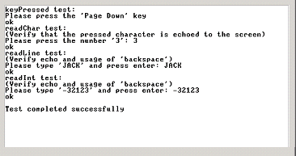
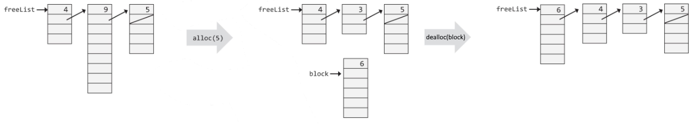

# Project 12: The Operating System

An Operating System (OS) is a collection of software services, designed to close
gaps between the computer's hardware and application software.

For example, if you use a high-level langauge to write a program that prompts
the user to enter some data using the keyboard, the code generated by the
compiler will include (among other things) calls to OS routines that handle
keyboard inputs. Therefore, the OS can also be viewed as an extension of a
high-level programming language.

This is a rather simplistic view of operating systems, but it will suffice for
our purpose.

## Objective

Implement the Jack OS specified in Chapter 12.

## Contract

Your Jack OS implementation should conform to the specifications given in the
template files, and should be as efficient as possible.
Anything not mentioned here or within the template files supplied to you should 
be implemented to match the built-in OS.

## Resources

- Unit 12 of the lectures and book
- The built-in JackCompiler
- The built-in VMEmulator
- The VMEmulator's tutorial

## What To Submit

- In any case where the expected behavior is unclear, you should match the
  built-in OS.
- Your submission should compile successfully on the built-in JackCompiler and
  run successfully on the built-in VMEmulator.
- You should submit a zip file with the following files:
  AUTHORS, Array.jack, Keyboard.jack, Math.jack, Memory.jack, Output.jack,
  Screen.jack, String.jack, Sys.jack.
- Include other files required by your project, if there are any.
- The submission should not contain any folder.
- The AUTHORS file must contain the following:
  - In the first line: login(s) of the author(s), separated by commas and
    nothing else! If you work alone, do not include a comma.
    Logins should be identical to the names of your home folders and are
    case-sensitive.
  - Name(s), email(s) and ID(s) of the project's author(s).
  - Any remarks you have about your submission.

## Proposed Working Method

The OS is implemented as a collection of 8 Jack classes.
Each class can be implemented and unit-tested in isolation, and in any desired
order. We recommend proceeding like so:

1. Array,
2. Sys,
3. String,
4. Keyboard,
5. Output,
6. Math (start with easy functions like abs, min, max, and then progress to
   multiply, sqrt and finally divide),
7. Memory (start with easy functions like init, peek, poke and then alloc and
   dealloc),
8. Screen (start with easy functions like init, clearScreen, setColor,
   drawPixel, drawRectangle, and then progress to drawCircle, drawLine)

### How to Work on Each Class

To develop, compile, and test each OSClass.jack class in isolation, follow this
procedure:

1. Put the OSClass.jack that you are developing in the same directory that
   includes the supplied test program designed to test it;
2. Compile the directory using the supplied Jack compiler.
   This will result in compiling your OSClass.jack as well as the supplied test
   class files. In the process, a new OSClass.vm file will be created;
3. Load the directory into the supplied VMEmulator;
4. Execute the code and check if the OS services are working properly,
   according to the guidelines given below.

Recall that the supplied VMEmulator features a built-in implementation of the
entire Jack OS. With that in mind, the rationale of the above procedure is as
follows.

Normally, when the supplied VMEmulator encounters a call to an OS
function, it handles the call by invoking a built-in implementation of that
function.

However, if the compiled directory contains a .vm file that includes
a VM implementation of the function, this implementation will be executed,
short-cutting the built-in implementation.

This practice follows the reverse engineering spirit of GNU Unix and Linux:
it allows you to build and test different OS modules in isolation, as if all the
other OS modules are implemented properly and operating side-by-side with the
currently-developed module. That's important, since the OS class that you are
presently developing may well include calls to the services of other OS classes.

For more information about our built-in tools, see the tutorials in the
lectures and submission page, and additional information provided in
tools/README.md.
This file also includes a general introduction to writing in Jack (see
"Developing Jack Applications").

### OS Classes and Test Programs

There are eight OS classes:
Memory, Array, Math, String, Screen, Keyboard and Sys.
For each OS class Xxx we supply a skeletal Xxx.jack class file with all
the required subroutine signatures, a corresponding test class named Main.jack,
and related test scripts.

Only Memory, Array and Math have tests with test scripts (.tst files).
To use their test scripts, you should copy your implementation to the test's
directory, compile the directory, execute the test script on the supplied
VMEmulator, and make sure that the comparison with the compare file ends
successfully.

The remaining test programs include no test scripts, and should be compiled and
executed on the supplied VMEmulator, and then their outputs should be compared
to the pictures supplied in each test directory.

Also, a great test for your OS implementation is your submission for project 9!

#### String, Output and Screen

The desired outputs for the String, Output and Screen classes are given here:

#### Keyboard

This class is tested via a test program that requires some user interaction. 
For each function in the Keyboard OS class (keyPressed, readChar, readLine,
readInt), the program requests the user to press some keyboard keys.

If the OS functions are implemented correctly and the requested keys are
pressed, the program prints the text "ok" and proceeds to test the next
function. If not, the program repeats the request for the same function.

If all requests end successfully, the program prints "Test ended successfully",
at which point the screen should look as follows:

#### Memory

The Memory class has an image that doesn't correspond to any test.
Instead, the image shows how allocating and deallocating memory affects the
freeList data-structure.

#### Sys

Only two functions in this class can be tested: Sys.init and Sys.wait.

The supplied test program tests the Sys.wait function by requesting the user to
press any key, waiting two seconds (using Sys.wait) and then printing another
message on the screen. The time that elapses from the moment the key is
released until the next message is printed should be roughly two seconds.

The Sys.init function is not tested explicitly. However, recall that it
performs all the necessary OS initializations and then calls the Main.main
function of each test program.
Therefore, we can assume that nothing would work properly unless Sys.init is
implemented correctly. A simple way to test Sys.init in isolation is to run the
supplied Pong game using your Sys.vm file.

### Additional Details

- Anything not mentioned here or within the .jack template files supplied to you
  should be implemented to match the built-in OS. So, if you're wondering how to
  support various input/output characters or anything else, you should write a
  short .jack file that tests this and run it using the built-in OS.
- You can add new functions/methods to classes, but can't add classes to the OS.
- You don't need to implement de-fragmentation, but I still recommend trying!
- Regarding some graphic-related details:
  - The cursor should be drawn as a filled (black) square when receiving input
    from the user, as the first line of readChar's pseudocode says:
    "display the cursor".
  - When the cursor reaches the end of the screen, it should be re-positioned 
    at the beginning of the screen (row 0, column 0). An example is given in
    OutputTest's Main.jack file, in lines 21-23.
  - The built-in Output class prints characters starting with the second row of
    pixels (16416) and not with the first (16384). This is a mistake, but you
    can implement either behavior.
  - The built-in implementation of drawLine and drawCircle is a bit different
    from the algorithms that you should implement; as long as you stick to the
    algorithms, everything is OK.

## The End

After testing successfully each OS class in isolation, test your entire OS
implementation using the Pong game, whose source code is available in your
projects/11/Pong directory. Put all your OS .jack files in this directory,
compile it, and execute the game in the supplied VMEmulator.

If the game works, then congratulations: you are the proud owner of an operating
system written entirely by you. And, by the way, you've just completed the
construction of a complete general-purpose computer system. Go celebrate!

## Tips

### Food For Thought

After you've finished the project, think of the following questions:

- How does the JackCompiler rely on the OS, and vice versa?
- What about the VMtranslator and the Assembler?
- After implementing the "multiply" function in the Math class, compare your
  Jack code to the assembly code you've written in project 4 and to the
  multiplication chip from project 2. Which is faster?

### OS API

The complete API of our operating system is given here.

#### Math

- function void init(): for internal use only.
- function int abs(int x): returns the absolute value of x.
- function int multiply(int x, int y): returns the product of x and y.
- function int divide(int x, int y): returns the integer part of x/y.
- function int min(int x, int y): returns the minimum of x and y.
- function int max(int x, int y): returns the maximum of x and y.
- function int sqrt(int x): returns the integer part of the square root of x.

#### String

- constructor String new(int maxLength): constructs a new empty string (of
  length zero) that can contain at most maxLength characters.
- method void dispose(): disposes this string.
- method int length( ): returns the length of this string.
- method char charAt(int j): returns the character at location j of this string.
- method void setCharAt(int j, char c): sets the j-th element of this string to c.
- method String appendChar(char c): appends c to this string and returns this string.
- method void eraseLastChar(): erases the last character from this string.
- method int intValue(): returns the integer value of this string (or of the
  string prefix until a non-digit character is detected).
- method void setInt(int j): sets this string to hold a representation of j
- function char backSpace( ): returns the backspace character.
- function char doubleQuote(): returns the double quote (") character.
- function char newLine( ): returns the newline character.

#### Array

- function Array new(int size): constructs a new array of the given size.
- method void dispose(): disposes this array.

#### Output

- function void init(): for internal use only.
- function void moveCursor(int i, int j): moves the cursor to the j-th column of
  the i-th row, and erases the character displayed there.
- function void printChar(char c): prints c at the cursor location and advances
  the cursor one column forward.
- function void printString(String s): prints s starting at the cursor location
  and advances the cursor appropriately.
- function void printInt(int i): prints i starting at the cursor location and
  advances the cursor appropriately.
- function void println(): advances the cursor to the beginning of the next line.
- function void backSpace(): moves the cursor one column back.

#### Screen

Column indices start at 0 and are left-to-right.
Row indices start at 0 and are top-to-bottom.
Screen size is 256 rows by 512 columns.

- function void init(): for internal use only.
- function void clearScreen(): erases the entire screen.
- function void setColor(boolean b): sets a color (white=false, black=true) to
  be used for all further drawXXX commands.
- function void drawPixel(int x, int y): draws the (x,y) pixel.
- function void drawLine(int xl, int yl, int x2, int y2): draws a line from
  (xl,yl) to (x2,y2).
- function void drawRectangle(int xl, int yl, int x2, int y2): draws a filled
  rectangle whose top left corner is (x1,y1) and bottom right corner is (x2,y2).
- function void drawCircle(int x, int y, int r): draws a filled circle of
  radius r <=181 around (x,y).

#### Keyboard

- function void init(): for internal use only.
- function char keyPressed(): returns the character of the currently pressed key
  on the keyboard; if no key is currently pressed, returns 0.
- function char readChar(): waits until a key is pressed on the keyboard and
  released, then echoes the key to the screen and returns the character of the
  pressed key.
- function String readLine(String message): prints the message on the screen,
  reads the line (text until a newline character is detected) from the keyboard,
  echoes the line to the screen, and returns its value. This function also
  handles user backspaces.
- function int readInt(String message): prints the message on the screen, reads
  the line (text until a newline character is detected) from the keyboard,
  echoes the line to the screen, and returns its integer value (until the first
  nondigit character in the line is detected). This function also handles user
  backspaces.

#### Memory

- function void init(): for internal use only.
- function int peek(int address): returns the value of the main memory at this
  address.
- function void poke(int address, int value): sets the contents of the main
  memory at this address to value.
- function Array alloc(int size): finds and allocates from the heap a memory
  block of the specified size and returns a reference to its base address.
- function void deAlloc(Array o): De-allocates the given object and frees its
  memory space.
- function int max(Array o): returns the maximal element contained in the given
  Array/object. Assume inputs are initialized and contain at least one element.

#### Sys

- function void init(): calls the init functions of the other OS classes, then
  calls the Main.main() function and finally Sys.halt(). For internal use only.
- function void halt(): halts the program execution.
- function void error(int errorCode): prints the error code on the screen and
  halts.
- function void wait(int duration): waits approximately duration milliseconds
  and returns.

### Operating system error codes

All errors which the built-in operating system detects are given here.
You can assume valid input, so there is no need to handle these errors.

| Code | Method/Function      | Description                                     |
| ---- | -------------------- | ----------------------------------------------- |
| 1    | Sys.wait             | Duration must be positive                       |
| 2    | Array.new            | Array size must be positive                     |
| 3    | Math.divide          | Division by zero                                |
| 4    | Math.sqrt            | Cannot compute square root of a negative number |
| 5    | Memory.alloc         | Allocated memory size must be positive          |
| 6    | Memory.alloc         | Heap overflow                                   |
| 7    | Screen.drawPixel     | Illegal pixel coordinates                       |
| 8    | Screen.drawLine      | Illegal line coordinates                        |
| 9    | Screen.drawRectangle | Illegal rectangle coordinates                   |
| 12   | Screen.drawCircle    | Illegal center coordinates                      |
| 13   | Screen.drawCircle    | Illegal radius                                  |
| 14   | String.new           | Maximum length must be non-negative             |
| 15   | String.charAt        | String index out of bounds                      |
| 16   | String.setCharAt     | String index out of bounds                      |
| 17   | String.appendChar    | String is full                                  |
| 18   | String.eraseLastChar | String is empty                                 |
| 19   | String.setInt        | Insufficient string capacity                    |
| 20   | Output.moveCursor    | Illegal cursor location                         |

## License

This file is part of nand2tetris, as taught in The Hebrew University, and
was written by Aviv Yaish. It is an extension to the specifications given
[here](https://www.nand2tetris.org) (Shimon Schocken and Noam Nisan, 2017),
as allowed by the Creative Common Attribution-NonCommercial-ShareAlike 3.0
Unported [License](https://creativecommons.org/licenses/by-nc-sa/3.0/).
